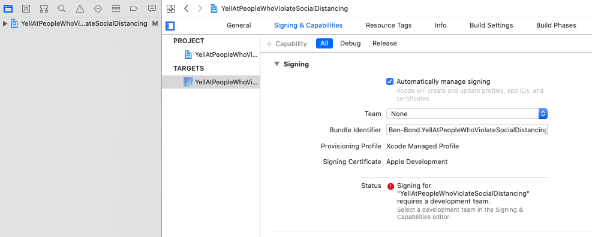

# YellAtPeopleWhoViolateSocialDistancing

## Description

This is an app that computes the distance to other people, and if they come within 6 feet, it yells at them (with customizable yelling phrases).

You can see a demo here: [https://youtu.be/9A4w-knARVw](https://youtu.be/9A4w-knARVw)

There are two different distance detection methods. Here's how to use each (and how they work):
1. AR  
This works by using Apple's Augmented Reality kit. This can detect people, then measure the distance to them. To use this, just point the phone in the general direction of people. The app will report the distance to the closest person.

2. Trig based  
To use this, point the + sign on the screen at the feet of the person that you want to measure the distance to. You also need to have input your height in the "Setup Data" screen. The app uses the angle of the phone, and the height that it's at (it assumes that you hold the phone at shoulder height, which is on average .82 of your full height).

## Warnings:
1. AR based distance detection is most accurate indoors and at close distances. When used outside, it may incorrectly report the distance to people who are far away (but it is accurate when they're close, the main use case of this app)
2. Trig based distance detection will not work well on unlevel ground

## Boring Legal Disclaimer
1. This is for entertainment only. It cannot prevent coronavirus. 

## Requirements:
1. iOS 13+
2. For AR distance mode, iphone with A12 Chip (iphone 11, XS, XS Max, XR) is required. Although Trig distance method will work for older phones. 

## Installation
1. Download the git repo. In a terminal window, run:  
`git clone https://github.com/HotSauceTea/YellAtPeopleWhoViolateSocialDistancing`  
2. Open the file YellAtPeopleWhoViolateSocialDistancing.xcworkspace in Xcode  
3. Plug in your phone to your computer. In the upper right, set the target device to be your iphone (Not a simulator)  
  
4. Update the "Team" in the "Signing and capabilities" tab to your account  
  
5. Click the traingular build button:  
  
6. On your phone, you will get a warning that this is from an untrusted developer (This should be you, since you signed it in step 4).  
To allow, go to Settings > General > Device Management and click allow  
e.g. https://apple.stackexchange.com/questions/206143/ios-untrusted-developer-error-when-testing-app
7. Open the App. Point it at people. Make it yell.
